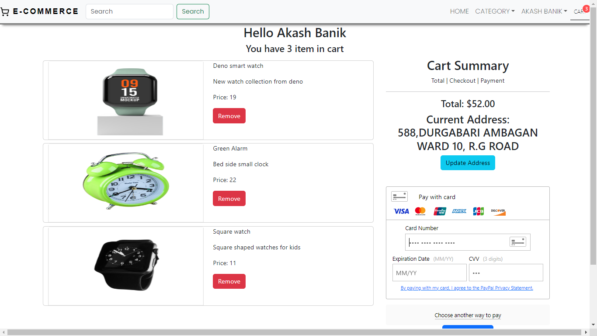
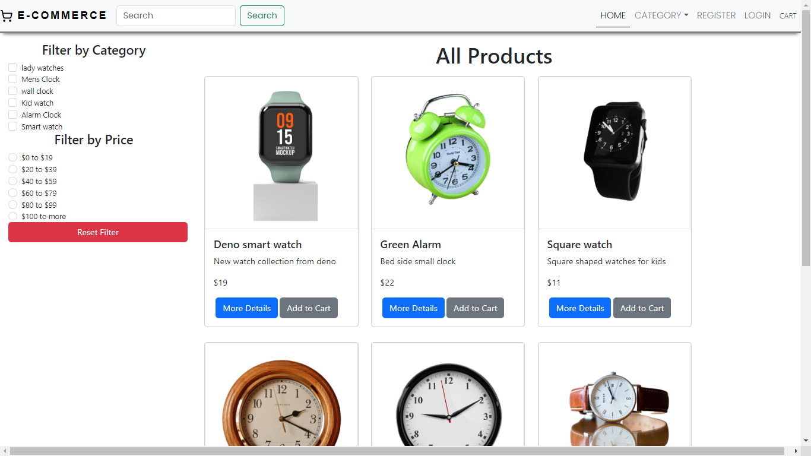
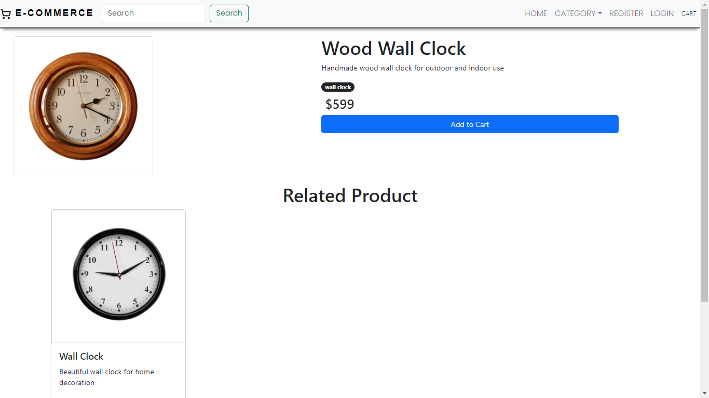
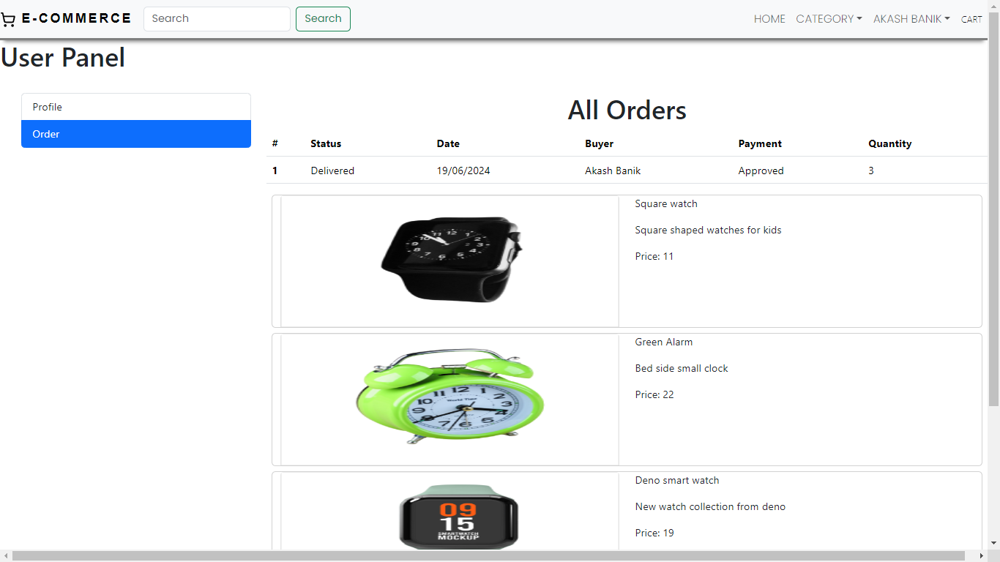

# buyBazar

<div align='center'>



</div>

A E-commerce site to buy your favorite things.


## Table of contents

- [buyBazar](#buybazar)
  - [Table of contents](#table-of-contents)
  - [Overview](#overview)
      - [Features](#features)
    - [User Authentication](#user-authentication)
    - [Filter Product](#filter-product)
    - [Pagination](#pagination)
    - [Product Management](#product-management)
    - [Security](#security)
    - [Cross-Origin Resource Sharing (CORS)](#cross-origin-resource-sharing-cors)
    - [Payment Integration](#payment-integration)
    - [Cart Management](#cart-management)
  - [Built with](#built-with)
      - [Frontend](#frontend)
      - [Backend](#backend)
      - [Database](#database)
  - [Contributing](#contributing)
  - [Getting Started](#getting-started)

## Overview






<div>

#### Features

### User Authentication

- **User Registration**: Users can sign up for an account by providing basic information such as username, email, and password.
- **User Login**: Registered users can log in securely using their credentials.
- **JWT Authentication**: JSON Web Tokens (JWT) are used for secure authentication and authorization of users.

### Filter Product

- **Category**: Category-based filter for a better user experience has been implemented.
- **Price**: Price-based filter for a better user experience has been implemented.
- **Direct Search**: Users can directly search for products using the search box.

### Pagination

- **Items per Page**: Users can select the number of items displayed per page to customize their viewing experience. They can load more product if they require.

### Product Management

- **Create Product**: Authenticated Admins can create new products by providing a title, price, and other relevant information.
- **Update Product**: Admins can edit and update their products to keep them current and accurate.
- **Delete Product**: Admins have the ability to delete their products if needed.

### Security

- **Password Hashing**: User passwords are securely hashed before storing them in the database to ensure confidentiality.
- **HTTPS**: Communication between the client and server is encrypted using HTTPS to prevent eavesdropping and man-in-the-middle attacks.

### Cross-Origin Resource Sharing (CORS)

- **CORS Configuration**: Cross-Origin Resource Sharing (CORS) is properly configured to allow restricted resources on a web page to be requested from another domain outside the domain from which the resource originated.

### Payment Integration

- **Braintree Integration**: Braintree is used to handle the payment system.
- **Payment Options**: Paypal and different card payment options are available during checkout and order processing.

### Cart Management

- **Add to Cart**: Users can add products to their cart for future purchase.
- **View Cart**: Users can view the contents of their cart at any time.
- **Update Cart**: Users can update the quantity of items in their cart or remove items if needed.
- **Save for Later**: Users can save items for later purchase.
</div>

<hr/>

## Built with

#### Frontend

- HTML5
- CSS
- Javascript
- [React](https://reactjs.org/) - JS library
- [Vite](https://vitejs.dev/guide/)

#### Backend

- Node.js
- Express.js

#### Database

- Mongo DB

> This project follows [Conventional Commits](https://www.conventionalcommits.org/en/v1.0.0/) message and [Model–view–controller](https://en.wikipedia.org/wiki/Model%E2%80%93view%E2%80%93controller) design pattern

<hr/>

## Contributing

Contributions are welcome! If you'd like to contribute to this project, please fork the repository and submit a pull request with your changes.

## Getting Started

1. Clone the repository.
2. Install dependencies for both api and client: `npm install`

   ```
   //frontend
   VITE_API=http://localhost:8080/

   //backend
    PORT=8080
    DB_URI="your mongo database string"
    DEV_DB=mongodb://127.0.0.1:27017/e-commerce
    ACCESS_TOKEN="Your secret token "
    BRAINTREE_MERCHANT_ID = "Brain tree merchant id"
    BRAINTREE_PUBLIC_KEY = "Brain tree public key"
    BRAINTREE_PRIVATE_KEY = "Brain tree private key"

   ```

3. Set up environment variables such as database connection string, JWT secret key, etc.
4. Start the server: `npm start`
5. Start the frontend development server: `npm start`
